# Nano Banana 3D Product Viewer (Images multi-angle view | not actual 3D model) for e-commerce

Kaggle "Nano Banana" Hackathon by Google DeepMind: https://www.kaggle.com/competitions/banana | [1](#references)

> Write-up in Kaggle [Product Multi-View with Nano Banana](https://www.kaggle.com/competitions/banana/writeups/product-multi-view-with-nano-banana)!

This project helps to make multi-angle product images view for e-commerce websites based on Google Gemini 2.5 Flash Image (Nano Banana), which is a state-of-the-art image generation / editing model. It can make product multi-view from the given reference image(s) of the product and optional visual effects text descriptions (not necessary). Then using ready easy-to-use JavaScript code in this GitHub repository, you can integrate multi-angle product image viewer for your e-commerce website.

## How to use

1. Go to [Product Multi-View with Nano Banana](https://ai.studio/apps/drive/1xoQrA5WbOE9DQx7xEXXH3EsJtEQPz5gs) Gemini AI Studio Application, where you can generate multi-angle product images using Nano Banana model. It will generate 6 images (left, right, top, bottom, front, back) based on your input image(s) and optional text description of visual effects. You can also use your own images generated by any other means. This application already has pre-defined prompts to generate high-quality studio product images.

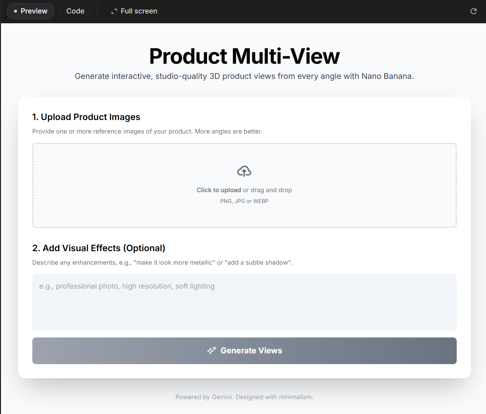

2. Upload image & if needed, add text description of visual effects. Then click "Generate" button. 

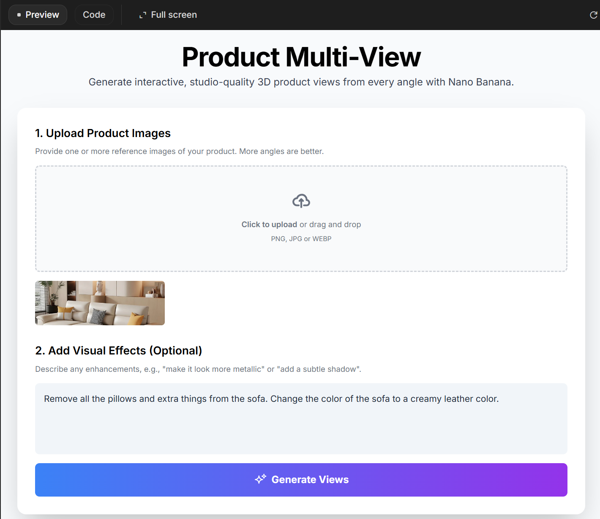

we used this sofa image for demo: [sample-sofa-image](assets/reference-photo.webp) | credits: [estre](https://www.estre.in/collections/fabric-sofa)

3. Wait until the images are generated. It will take around ~1-2 minutes.

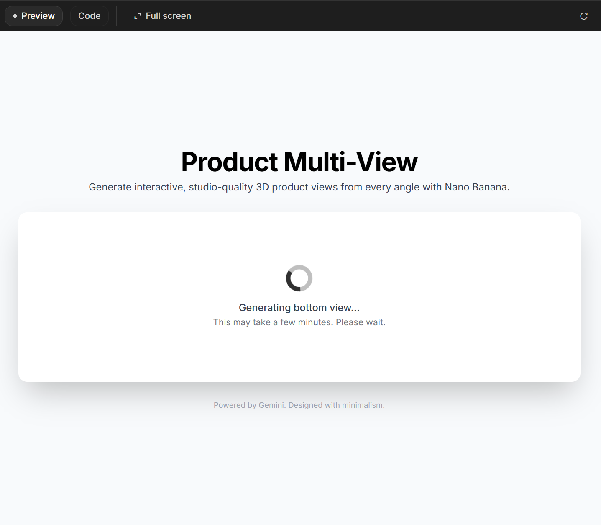

4. After the images are generated, you can interact with multi-view product image viewer. You can rotate the product image by clicking the arrows or using arrow keys on your keyboard.

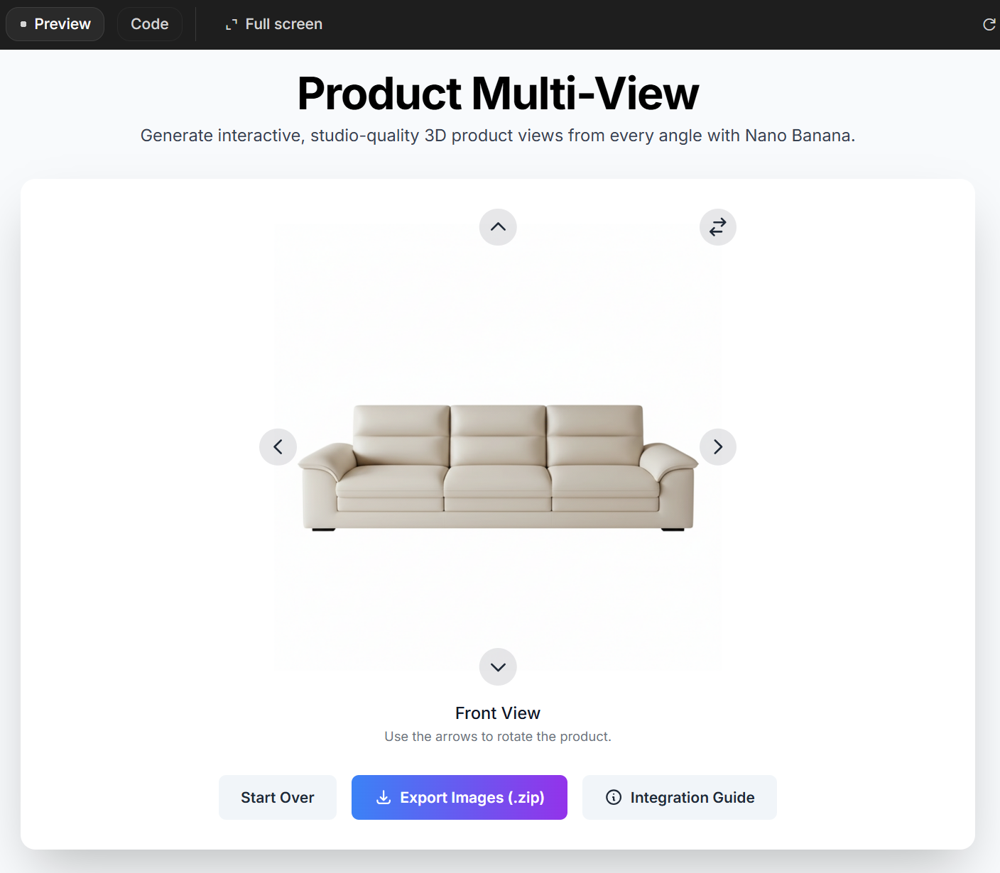

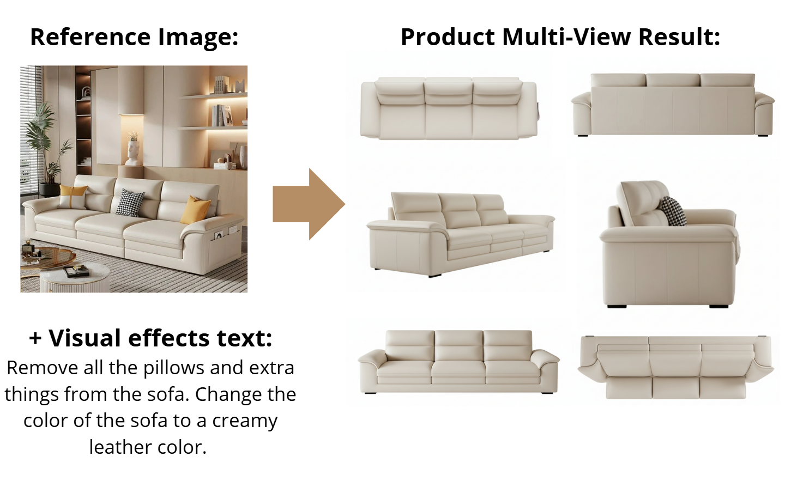

5. Download the generated images by clicking "Export Images (.zip)" button. It will download a zip file containing all the generated images (back.png, front.png, left.png, right.png, top.png, bottom.png).

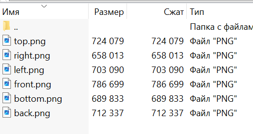

6. To integrate multi-angle product image viewer for your e-commerce website, copy the code from [multiview-block.html](multiview-block.html) file and paste it into your website's HTML file. Then replace the image URLs in the code with your own generated image URLs or just replace files in "images" folder with your own images keeping the same file names (back.png, front.png, left.png, right.png, top.png, bottom.png).

7. Enjoy your multi-angle product image viewer on your e-commerce website! Demo: [View Products in Multi-View (Interactive Mode)](https://silvermete0r.github.io/product-multi-view-integration-guide-nano-banana/) from reference images: [link](references/demo-references.rar)

# My observations

- In the e-commerce industry, having multiple views of a product is crucial for providing customers with a comprehensive understanding of the item they are considering purchasing. 3D models are often used to achieve more user-friendly experiences, but they can be expensive and time-consuming to create and need 3D modeling experts [2](#references). Heavy 3D models slowers websites & mobile apps [3](#references). 
 - **Multi-view images are a more cost-effective and efficient alternative to 3D models**, as they can be generated quickly and easily using image generation models like Nano Banana. Multi-view images can provide customers with a better understanding of the product's shape, size, and features, which can help to increase customer confidence and reduce the likelihood of returns.
- The best commercial use-case for Multi-View using Nano Banana is in the industry of cars, furniture, fashion (clothes, shoes, bags, accessories), electronics (phones, laptops, cameras), home decor (lamps, vases, clocks), toys & collectibles. These industries often require detailed product views from multiple angles to help customers make informed purchasing decisions. Taking multiple photos of products from different angles can be time-consuming and expensive. Nano Banana can generate high-quality multi-view images quickly and cost-effectively, making it an attractive option for businesses looking to improve their product listings.
- **Especially car industry can benefit a lot from this technology**, as cars have complex shapes and details that are difficult to capture in a single image. Multi-view images can help customers see the car from all angles, including the interior and exterior, which can be especially important for online car sales, saving time and money for car dealerships. Experimentally, I observed that car images generated by Nano Banana are of very high quality and look very realistic. Examples:

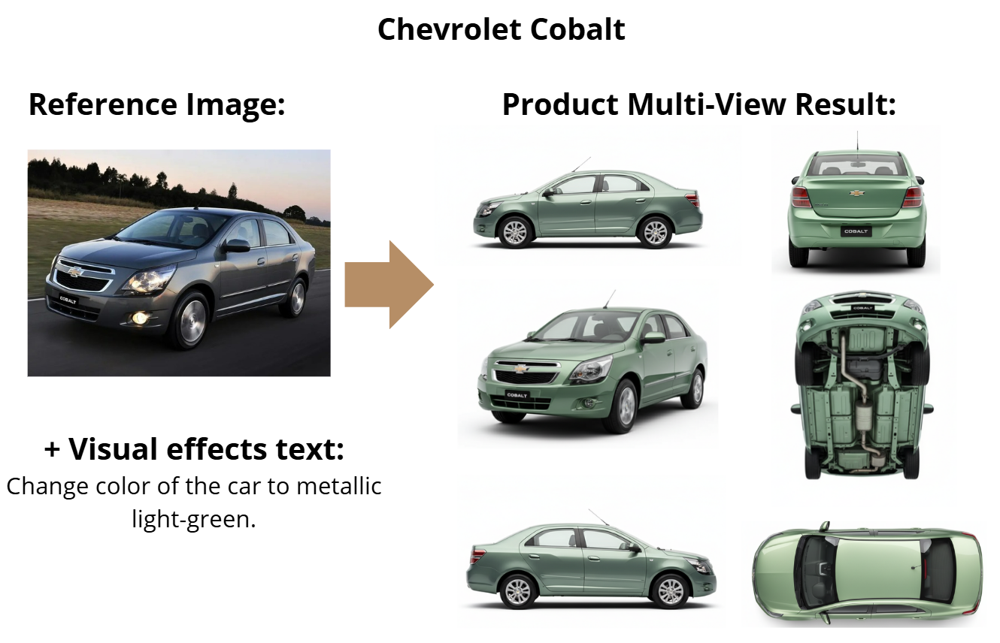

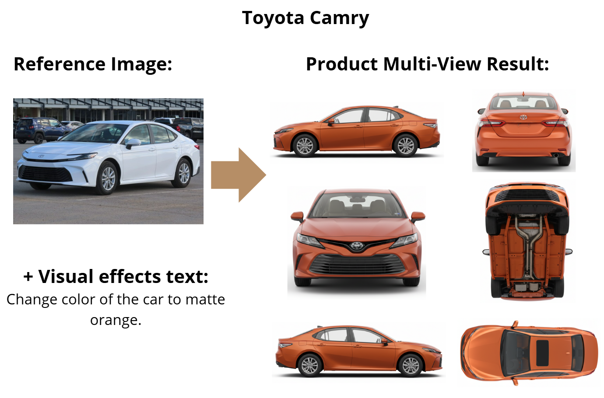

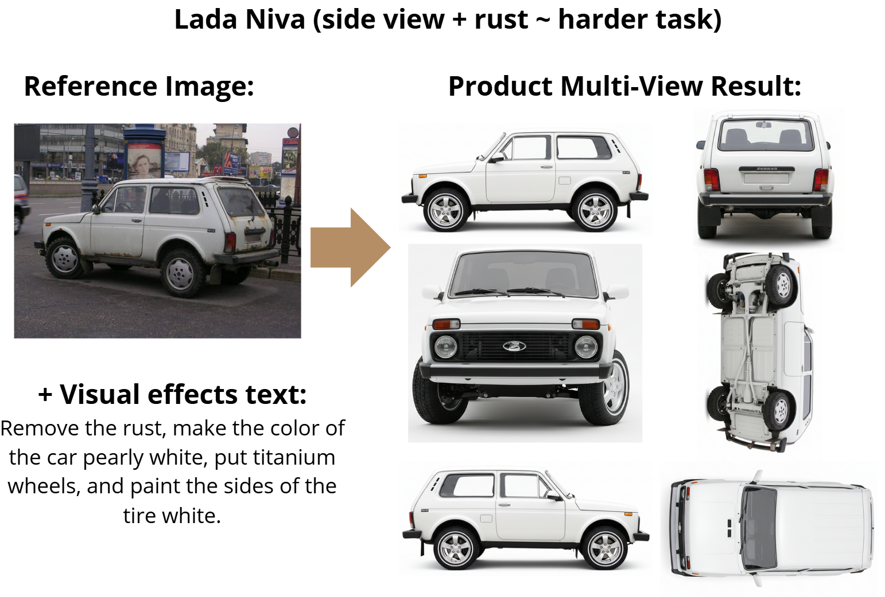

- The quality of the generated images can vary depending on the input image(s) and the text description provided. It may take some experimentation to find the best prompts and settings for your specific use case.

# Other example multi-views generated by Nano Banana:

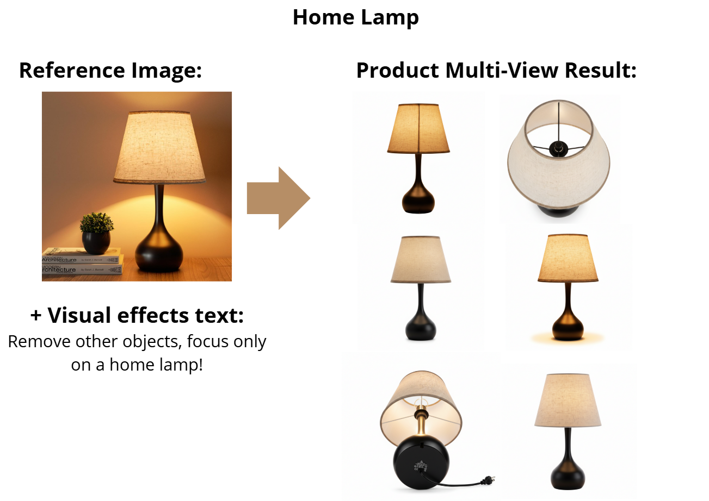

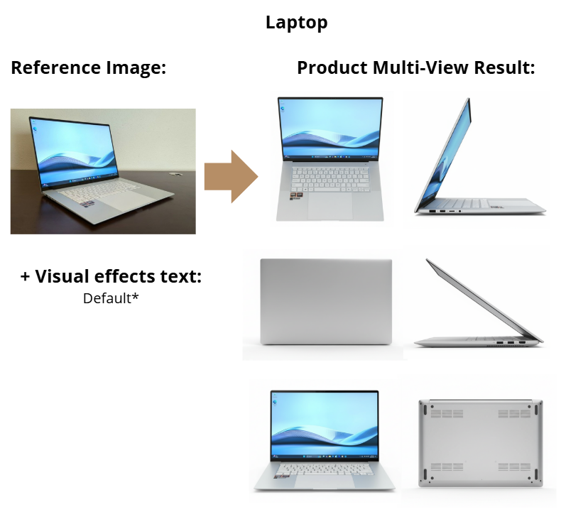

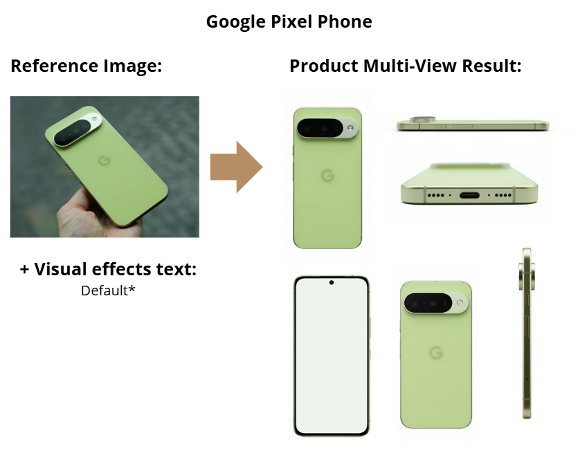

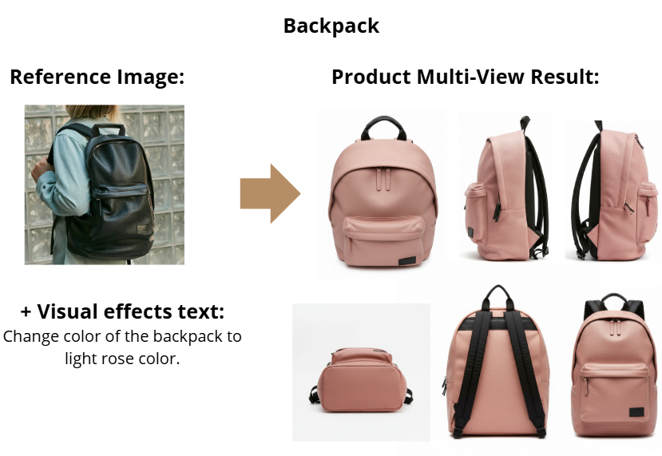

# The best result (car) 🔥

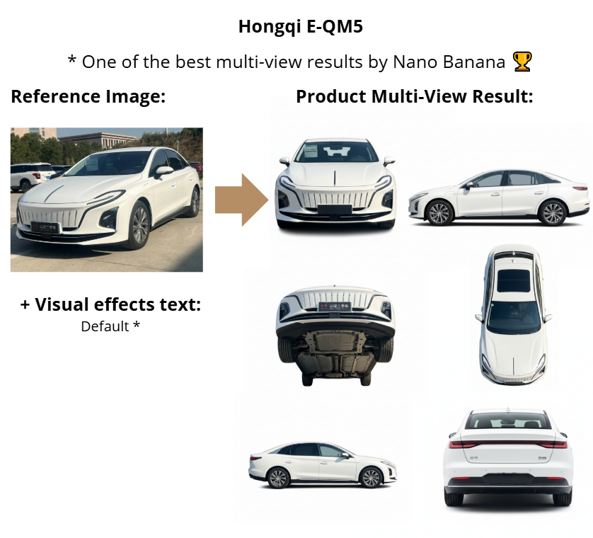

Demo is here: [View Products in Multi-View (Interactive Mode)](https://silvermete0r.github.io/product-multi-view-integration-guide-nano-banana/)

# References

1. Logan Kilpatrick, Omar Sanseviero, Paige Bailey, Amit Vadi, Lauren Usui, Lloyd Hightower, Philipp Schmid, Patrick Löber, Guillaume Vernade, Ammaar Reshi, Natalie Dao, M.E. Francis, Harrison Jobe, JD Choi, Vishal Dharmadhikari, Pradeep Kuppala, Christina Warren, Alisa Fortin, Meg Risdal, and Addison Howard. Nano Banana Hackathon. https://kaggle.com/competitions/banana, 2025. Kaggle.
2. For the thesis article (Joel Toivainen, 2019) from Theseus:
Toivainen, J. (2019). 3D model management for e-commerce (Bachelor’s thesis). Degree Programme in Information Technology, Theseus. [link](https://www.theseus.fi/bitstream/handle/10024/172424/Toivainen_Joel.pdf)
3. 3D Cloud. (2025). 3D e-commerce simplified: Basics, strategies & best practices. 3dcloud.com. [link](https://3dcloud.com/3d-e-commerce/)